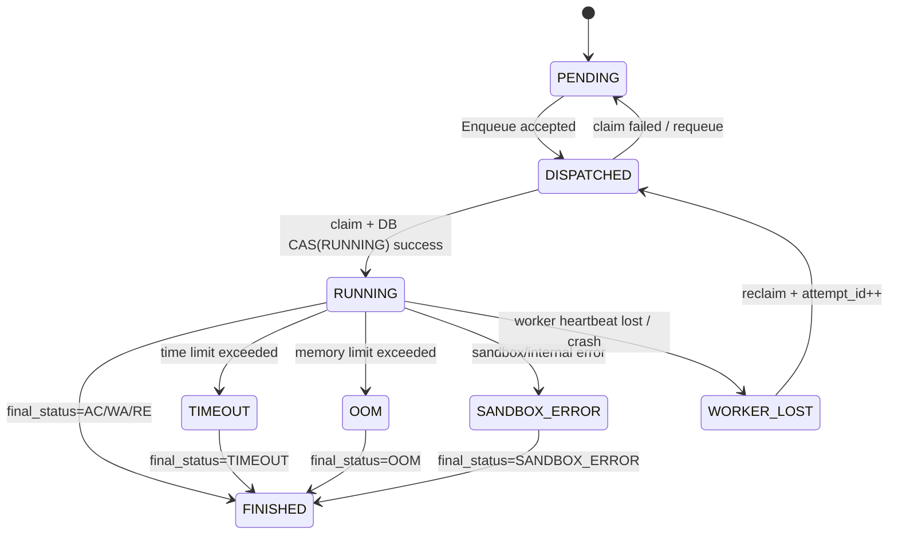
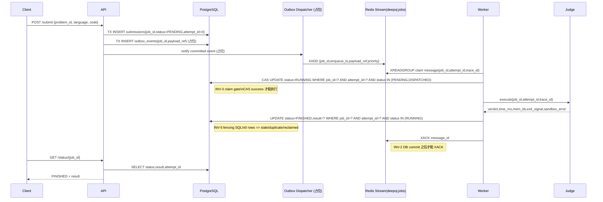
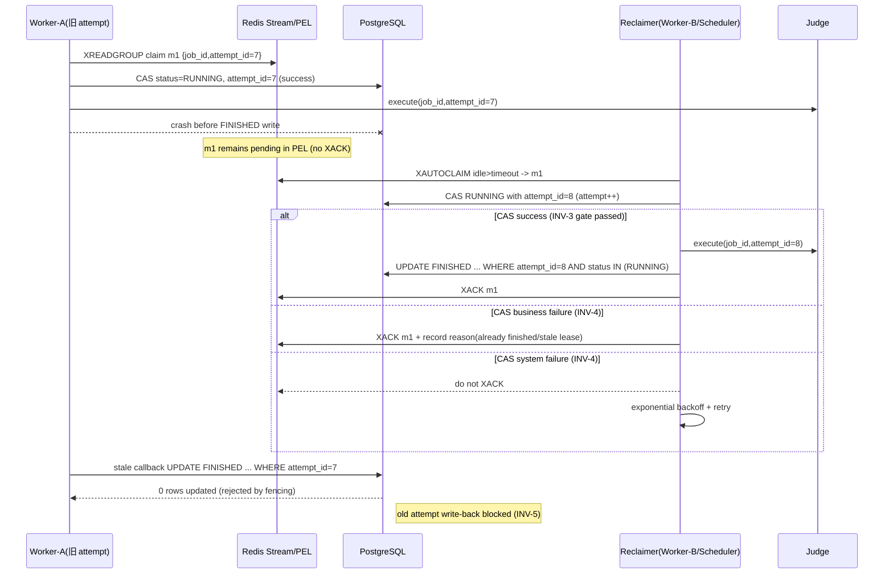

# Deep-OJ Design Skeleton (A2)

## 系统目标
Deep-OJ 的核心目标是构建一个可恢复、可观测、结果不乱序的判题系统：提交请求进入任务驱动层后，任何执行、重试、回收和崩溃恢复都必须以数据库中的状态机为准绳，确保同一 `job_id` 在多次投递、节点故障和重复回写下仍保持单一可信结果。

## 核心组件边界

| 组件 | 责任边界（做什么） | 非责任边界（不做什么） |
| --- | --- | --- |
| API | 鉴权、限流、参数校验、写入提交记录、触发入队 | 不直接执行判题、不直接确认队列消息 |
| Scheduler | 编排与恢复策略（重试/回收/DLQ/背压），可承载 dispatcher/reclaimer | 不作为结果权威存储 |
| Worker | claim 任务、执行判题流程、写回执行结果、按规则 ACK | 不定义业务终态语义 |
| Judge | 编译/运行/资源限制/输出采集，产出结构化执行结果 | 不维护分布式状态机 |
| Redis | Streams/PEL/缓存/短期协调数据 | 不作为完成状态真相源 |
| DB (PostgreSQL) | 任务状态机、attempt fencing、最终结果权威存储 | 不承担高频队列消费 |
| MinIO | 测试数据与题目资产存储 | 不维护任务状态 |
| Etcd | 服务发现、租约、实例活性 | 不存储判题业务状态 |
| Prometheus | 指标采集与告警输入 | 不承载业务日志明细 |

**结论：DB 为唯一状态机，Streams 仅驱动执行，不承诺最终完成语义。**

## 设计不变量（10 条）

1. `INV-1` Job 完成定义：`status=FINISHED` 且 `attempt_id` 匹配，队列仅驱动。  
2. `INV-2` ACK 顺序：必须 DB 落盘成功后再 `XACK`。  
3. `INV-3` claim 门禁：`claim -> DB CAS(RUNNING)` 成功才允许执行。  
4. `INV-4` CAS 失败分流：业务性失败立即 `XACK`；系统性失败不 `XACK` 并退避重试。  
5. `INV-5` FINISHED fencing SQL 固化：`UPDATE ... WHERE job_id=? AND attempt_id=? AND lease_owner=? AND lease_until>NOW() AND status='running' AND state='processing'`；0 行更新必须解释 reason。  
6. `INV-6` 可观测约束：metrics 禁止 `job_id` label；日志/追踪可带 `job_id+attempt_id+trace_id` 且需采样/限流。  
7. `INV-7` 可回滚性：关键路径具备 feature flag，agent 失败可降级 `exec CLI`。  
8. `INV-8` 双写一致性：提交持久化与入队事件必须通过事务+outbox（或等效机制）避免丢单。  
9. `INV-9` 重试有界：每个 job/attempt 重试必须有上限；超限后由责任组件进入 DLQ。  
10. `INV-10` kill/清理幂等：进程组 kill、cgroup/namespace 清理可重复执行且不报错。  

## Job 状态机



## 正常路径时序（含 INV-2 / INV-5）



## 崩溃恢复时序（Worker 在 DB FINISHED 前崩溃）



## 责任边界表

| 关键动作 | 主责组件 | 触发方式 | 失败后的重试/退避/DLQ 责任 |
| --- | --- | --- | --- |
| 提交落库（PENDING） | API | HTTP submit 事务写 DB | API 返回错误；不自行重试业务提交 |
| 出队/claim | Worker Consumer（当前实现过渡期可由 Scheduler 代理） | `XREADGROUP` / reclaim | claim 失败由 consumer 退避；系统故障不 ACK |
| RUNNING 状态变更 | Worker（claim 成功后） | DB CAS `PENDING/DISPATCHED -> RUNNING` | CAS 业务失败按 INV-4 直接 ACK；系统失败退避重试 |
| 判题执行 | Worker + Judge | RUNNING 成功后执行 | Worker 按 attempt 重试上限控制 |
| FINISHED 状态变更 | Worker | 执行完成后 DB fencing UPDATE | 0 行更新视为 stale，记录 reason，不覆盖新 attempt |
| XACK | Worker/Reclaimer | 仅在 DB 成功写入后 | 严禁提前 ACK；系统故障保持 pending |
| 回收 reclaim | Reclaimer（Worker 或 Scheduler） | `XAUTOCLAIM/XCLAIM` | 按 INV-4 分流：业务失败 ACK；系统失败退避 |
| DLQ 入队 | Scheduler/Reclaimer（控制面） | 超过重试上限 | TODO（D1/C6）：统一离线 replayer 与审计字段 |

## C1 Streams 入队（API）

API 在创建 Job 后将任务写入 Redis Streams（默认 `deepoj:jobs`，可通过 `JOB_STREAM_KEY`/`JOB_STREAM_MAXLEN` 配置）。Streams **仅用于驱动执行**，不改变“DB 为唯一状态机”的不变量（INV-1/INV-5 等保持不变）。

C1 写入顺序与失败语义（为 C2 做基线收敛）：

- 先写 payload：`SET task:payload:<job_id> <payload-json>`，TTL 默认 24h（`JOB_PAYLOAD_TTL_SEC`）。
- payload 内容为 `schema_version=1` 的 envelope（字段：`schema_version`、`task_data_b64`、`encoding=base64`、`content_type=application/json`）。
- 再 `XADD` 到 stream，字段至少包含：`job_id`、`enqueue_ts`（ms）、`payload_ref`、`priority`。
- 若 payload 写入失败：直接返回 5xx，不执行 `XADD`。
- 若 `XADD` 失败：best-effort `DEL payload_ref`，返回 5xx，并记录结构化日志（`job_id`/`trace_id`/`reason`）。

### 配置读取语义（收敛）

- 服务运行时统一通过 `LoadConfig()/ReadFromEnv` 语义从环境变量读取配置。
- `cmd/*/main.go` 中读取 `config.yaml` 仅用于“缺省值回填”（`SetEnvIfEmpty*`），不改变“运行参数以环境变量为准”的规则。

## C2 Worker Streams Consumer Group（XREADGROUP + INV-2）

Worker 以 consumer group 方式消费 `deepoj:jobs`（默认）：

- stream key：`JOB_STREAM_KEY`（默认 `deepoj:jobs`）
- group：`JOB_STREAM_GROUP`（默认 `deepoj:workers`）
- consumer：优先 `JOB_STREAM_CONSUMER`，否则复用 `WORKER_ID`；两者都未设置时回退 `hostname-pid`
- 启动时执行：`XGROUP CREATE <stream> <group> $ MKSTREAM`（`BUSYGROUP` 忽略）
- 读取新消息：`XREADGROUP GROUP <group> <consumer> COUNT N BLOCK 2000 STREAMS <stream> >`

INV-2 精确定义与执行分流（代码：`src/go/internal/worker/stream_consumer.go`）：

1. 字段缺失（`job_id/enqueue_ts/payload_ref/priority`）=> reason=`missing_field`，`XACK`（poison message 不阻塞）。
2. payload 缺失或解析失败 => reason=`payload_missing_or_invalid`，`XACK`。
3. DB claim/CAS 拒绝（非 pending）=> reason=`db_claim_reject`，`XACK`。
4. DB 错误（连接/超时等）=> reason=`db_error`，**不 XACK**（消息留在 PEL，由 C4 reclaim loop 处理）。
5. DB CAS 成功后才允许 `XACK`；`XACK` 失败记录 reason=`xack_error`（重试一次，无限重试禁止）。

说明：

- DB 仍是唯一状态机；Streams 仅驱动执行。
- `XACK` 表示“该条 stream 消息被消费确认”，不代表 job 已 FINISHED。
- 即使发生 `XACK` 失败，也不会导致重复执行覆盖：后续重复消费会再次经过 DB claim/fencing（attempt_id + `WHERE job_id AND attempt_id AND status='running'`）门禁，旧 attempt 的写回会被拒绝。

## C3 Attempt Fencing + Lease（INV-3）

Worker 在消费 `deepoj:jobs` 时执行以下闭环（代码：`src/go/internal/worker/stream_consumer.go`）：

1. `claim -> DB CAS(RUNNING)`：`attempt_id = attempt_id + 1`，写入 `lease_owner` / `lease_until`，返回新的 `attempt_id` fencing token。
2. heartbeat：按 `JOB_HEARTBEAT_SEC` 刷新租约（`JOB_LEASE_SEC`）。
3. judge 执行：携带 claim 返回的 `attempt_id` 调用 judge（B2 协议校验继续生效）。
4. fenced 写回：`UPDATE ... WHERE job_id=? AND attempt_id=? AND lease_owner=? AND lease_until>NOW() AND status='running' AND state='processing'`。
5. 仅 fenced 写回成功后 `XACK` 当前 stream entry（INV-2）。

分流规则：

- `db_claim_reject`：业务重复/已被抢占，`XACK`。
- `db_error`：DB 故障，不 `XACK`（留在 PEL，由 C4 reclaim）。
- `lease_lost` 或 `db_error_heartbeat`：停止本地执行，不写回、不 `XACK`。
- poison（`missing_field` / `payload_missing_or_invalid`）：先标记 DB `System Error + error_code`，再 `XACK`。

## C4 PEL Reclaim（XAUTOCLAIM + INV-4）

Worker 在主消费循环外启动周期性 reclaim loop（代码：`src/go/internal/worker/stream_consumer.go`）：

- 周期：`JOB_RECLAIM_INTERVAL_SEC`（默认 5s）
- 批量：`JOB_RECLAIM_COUNT`（默认 16）
- idle 门槛：`min_idle_ms >= (JOB_LEASE_SEC + JOB_RECLAIM_GRACE_SEC) * 1000`（默认 `75,000ms`）
- 命令：`XAUTOCLAIM <stream> <group> <consumer> <min-idle-ms> <start>`
- 游标推进：reclaim loop 持久化 `next_start_id`（跨 tick 保留），每次从上次 `XAUTOCLAIM` 返回的游标继续扫描；避免每轮固定从 `0-0` 全量重扫。

处理分流（INV-4）：

1. `XAUTOCLAIM` 拉回 entry 后先校验字段/payload；poison（`missing_field`、`payload_missing_or_invalid`）先写 DB 终态，再 `XACK`。
2. 对可解析 entry 执行 DB reclaim CAS（`ReclaimSubmissionForRun`）：
   - 仅当 `status='running' AND state='processing' AND lease_until < now()` 才允许 reclaim，并执行 `attempt_id = attempt_id + 1`（fencing token 更新）。
3. reclaim decision 分流：
   - `claimed`：允许执行 judge，之后仍走 C3/C5 的 fenced finalize（`WHERE job_id AND attempt_id AND lease_owner AND lease_until>NOW() AND status='running' AND state='processing'`），**仅 finalize 成功后 `XACK`**。
   - `done_or_stale` / `not_found`：业务性不可恢复，直接 `XACK` 丢弃，避免 PEL 堆积。
   - `lease_still_valid`：当前 lease 仍有效，不执行、不 `XACK`，保留给原 consumer。
   - `db_error`：系统故障，不 `XACK`，保留待下次重试。
4. 执行完成后的结果 `attempt_id` 若与本次 claim/reclaim attempt 不一致，不提前 `return`；会强制覆盖为本次 attempt 再走 fenced finalize。若 finalize 返回 0 行则归类 `stale_attempt` 并 `XACK`。

说明：

- DB 仍是唯一状态机；Streams reclaim 仅负责驱动重试，不改变最终完成定义。
- `XACK` 失败不会破坏去重安全性，因为 DB claim/reclaim CAS + finalize fencing 共同保证旧 attempt 写回被拒绝。

## C5 FINISHED 幂等入库（INV-5）

Worker finalize 落库采用“先 UPDATE，后解释 0 行”的固定口径（代码：`src/go/internal/repository/postgres.go`）：

```sql
UPDATE submissions
SET status = $3,
    state = 'done',
    result = $4,
    lease_owner = NULL,
    lease_until = NULL,
    updated_at = NOW()
WHERE job_id = $1
  AND attempt_id = $2
  AND lease_owner = $5
  AND lease_until IS NOT NULL
  AND lease_until > NOW()
  AND status = 'running'
  AND state = 'processing';
```

规则：

1. `rows_affected = 1`：finalize 成功，允许后续 `XACK`。
2. `rows_affected = 0`：必须查询当前行并解释拒绝 reason（禁止 silent drop）：
   - `stale_attempt`：DB `attempt_id > current_attempt_id`
   - `already_finished`：`state='done'` 或 status 已终态
   - `not_in_expected_state`：status/state 不在 `running/processing`
   - `lease_lost_or_owner_mismatch`：lease_owner 不匹配或 lease 已过期/缺失
   - `db_error`：解释阶段 DB 查询失败（系统性错误）

处理策略（`src/go/internal/worker/stream_consumer.go`）：

- 业务性拒绝（`stale_attempt` / `already_finished` / `not_in_expected_state` / `lease_lost_or_owner_mismatch`）：
  - 记录结构化日志（`job_id/attempt_id/reason/db_attempt_id/db_status/db_state/db_lease_owner/db_lease_until`）
  - 递增低基数指标 `worker_finalize_rejected_total{reason=...}`
  - 作为业务拒绝处理并 `XACK`（避免卡 PEL）
- 系统性失败（`db_error`）：
  - 记录错误日志 + `worker_finalize_errors_total`
  - 不 `XACK`，保留消息在 PEL 等待后续 reclaim

## C6 Streams 保留与清理（MAXLEN~）

API 入队在 `XADD` 时启用近似裁剪：

- `XADD <stream> MAXLEN ~ <N> * ...`
- `N` 由 `JOB_STREAM_MAXLEN` 控制（默认 `200000`，可通过 `config.yaml` 的 `api.stream.stream_maxlen` 回填）

设计原因：

- 避免 Stream 无界增长造成 Redis 内存膨胀；
- 使用 `MAXLEN ~` 而非精确 `=`，降低每次入队裁剪开销，保持写路径稳定。

保留窗口估算口径：

- `window_seconds ≈ maxlen / enqueue_qps`
- 例如 `maxlen=200000`、峰值 `enqueue_qps=50` 时，窗口约 `4000s`（约 66 分钟）。

风险与建议：

- `maxlen` 过小会增加“消息被过早裁剪”的风险（尤其 backlog 高时）。
- 推荐将 `maxlen` 设为明显大于峰值 backlog 的数量级，并结合 `XLEN / XINFO GROUPS / XPENDING` 的 backlog 指标动态调优。
- 运维可在必要时手动执行 `XTRIM MAXLEN ~ <N>` 进行补救清理；该操作幂等。

## D1 Outbox Pattern（DB 同事务写 submissions + outbox）

目标：消除 API 提交路径的 DB+Redis 双写窗口。提交请求只依赖 DB 成功即可返回，Redis 不可用时不丢单。

事务边界（`src/go/internal/repository/postgres_outbox.go`）：

1. 在同一个 DB 事务中写 `submissions`（`pending`）和 `outbox_events`（`pending`）。
2. 事务提交后 API 直接返回 `job_id`，不等待 Redis。
3. `OUTBOX_ENABLED=true`（默认）时走该路径；`false` 时回退到旧直投递路径（仅回滚/调试）。

`outbox_events` 核心字段：

- `job_id`（UNIQUE）
- `payload`（jsonb，存可重建 task payload 的完整数据）
- `status`（`pending|delivered`）
- `attempts` / `next_attempt_at` / `last_error`
- `dispatched_at` / `stream_entry_id`

dispatcher 语义（`src/go/internal/api/outbox_dispatcher.go`）：

1. 周期拉取：`status='pending' AND dispatched_at IS NULL AND next_attempt_at <= now()`。
2. 使用 `FOR UPDATE SKIP LOCKED` + 单条 `UPDATE ... RETURNING` claim 行，并在 claim 时增加 `attempts`、计算指数退避 `next_attempt_at`。
3. 投递流程：`SET task:payload:<job_id>`（含 TTL） -> `XADD deepoj:jobs`（字段保持 `job_id/enqueue_ts/payload_ref/priority`）。
4. 成功：标记 `delivered` + 记录 `stream_entry_id`。
5. 失败：保留 `pending`，写 `last_error`，等待下次重试。

失败语义与一致性：

- API 在 Redis down 时仍成功（只要 DB 事务成功）。
- dispatcher 是 at-least-once；允许重复投递。
- 重复消息由既有 Worker claim/lease/fencing（INV-3/INV-5）在业务侧快速拒绝并 `XACK`，不会覆盖新 attempt 结果。

可观测性（低基数）：

- `api_outbox_dispatch_total{status,reason}`
- `api_outbox_dispatch_latency_seconds`（Histogram）
- `api_outbox_pending`

迁移与回滚：

- 迁移：`sql/migrations/007_add_outbox_events.sql`（新增 outbox 表及索引）。
- 回滚（手动）：`DROP INDEX idx_outbox_pending_retry/idx_outbox_job_id` 后 `DROP TABLE outbox_events`。

## Judge JSON 协议 v1

用于 Worker 与 C++ Judge 之间的运行结果交换（stdout 单行 JSON）。

字段定义：

- `schema_version`：协议版本（当前 `1`）。
- `job_id`：任务 ID（Worker 透传）。
- `attempt_id`：尝试次数 ID（Worker 透传）。
- `verdict`：**sandbox verdict（运行层结论）**。仅表示运行阶段结果，不代表最终判题结论。
  - `OK` 表示 sandbox 运行成功完成。
  - `TLE/MLE/OLE/RE/SE` 表示 sandbox 运行层错误或限制触发。
  - **AC/WA 由上层比对/判题逻辑决定**：当前实现位于 `src/go/internal/worker/judge.go`，在 `res.Status == "Finished"` 时执行输出比对（`CompareFiles`/`RunChecker`）并产出 `Accepted/Wrong Answer`。
- `time_ms`：本次运行用时（ms）。
- `mem_kb`：本次运行内存峰值（KB）。
- `exit_signal`：进程退出信号（0 表示无信号）。
- `sandbox_error`：沙箱错误码（无错误为空字符串）。

兼容字段（旧解析器仍可使用，不应因新增字段而崩溃）：

- `status` / `time_used` / `memory_used` / `exit_code` / `error`

注意：

- C3 起，Worker 会使用 DB claim 返回的真实 `attempt_id` 透传给 judge。
- Worker 在 `src/go/internal/worker/executor.go` 的 `parseAndValidateJudgeOutput` 做协议校验；失败时返回 error、记录日志并递增 `judge_protocol_errors_total{reason=...}`，结果不写入后续流程。
- Worker 执行 judge 时并发 drain stdout/stderr，并按上限截断但继续 drain：`JUDGE_STDOUT_LIMIT_BYTES`（默认 256KB）、`JUDGE_STDERR_LIMIT_BYTES`（默认 1MB）。

## Observability（Worker）

日志字段规范（结构化）：

- `job_id`
- `attempt_id`
- `trace_id`（Worker 入口若缺失则生成，并贯穿执行/判题/回写日志）

核心指标（低基数标签）：

- `judge_exec_duration_seconds{result}`（result=ok/reject/error/timeout）
- `judge_exec_inflight`
- `judge_exec_total{result}`
- `judge_verdict_total{verdict}`
- `judge_protocol_errors_total{reason}`
- `judge_output_truncated_total{stream}`
- `worker_claim_total{status,reason}`
- `worker_lease_heartbeat_total{status,reason}`
- `worker_stale_attempt_total`
- `worker_finalize_total{status}`
- `worker_finalize_rejected_total{reason}`
- `worker_finalize_errors_total`
- `worker_finalize_latency_ms`
- `worker_reclaim_total{status,reason}`
- `worker_reclaim_latency_ms`
- `worker_reclaim_inflight`

约束：

- Metrics 标签 **禁止** 使用 `job_id`（或任何请求级唯一 id）；定位单个 job 仅依赖日志/trace。

示例输出（单行）：

```json
{"schema_version":1,"job_id":"job_123","attempt_id":0,"verdict":"OK","time_ms":12,"mem_kb":2048,"exit_signal":0,"sandbox_error":"","status":"Finished","time_used":12,"memory_used":2048,"exit_code":0}
```
