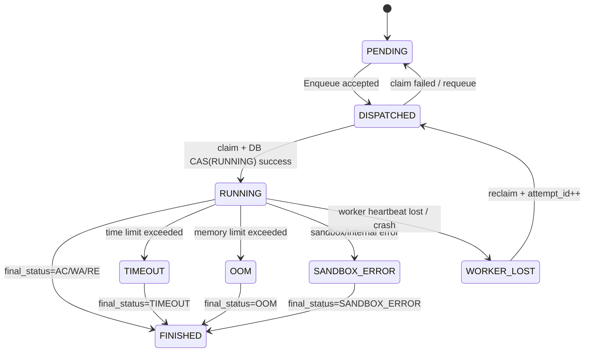
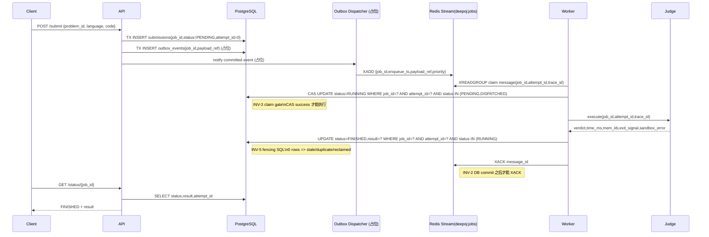
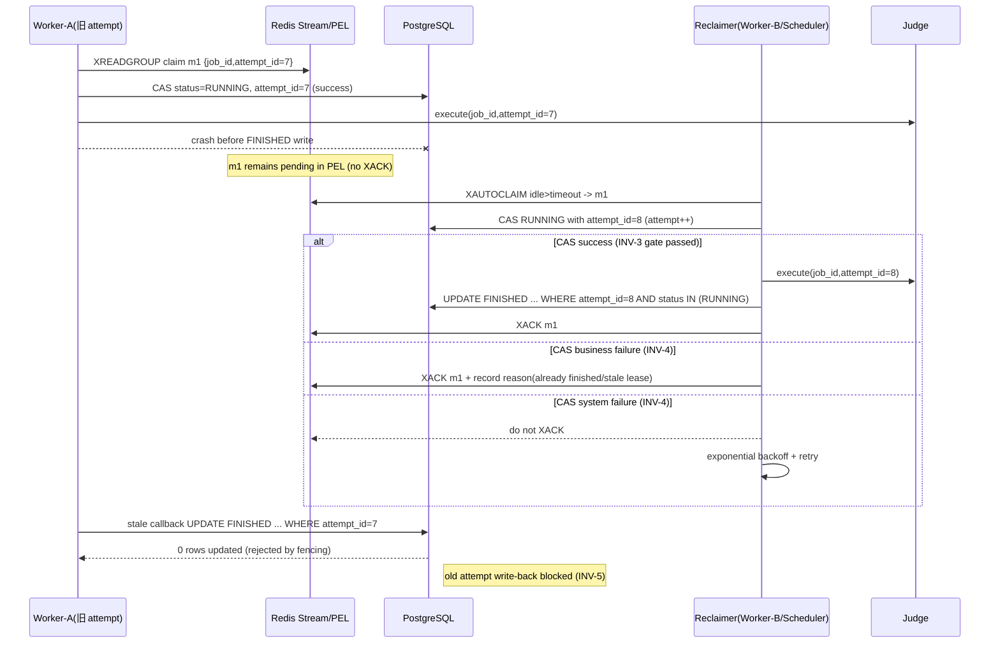

# Deep-OJ Design Skeleton (A2)

## 系统目标
Deep-OJ 的核心目标是构建一个可恢复、可观测、结果不乱序的判题系统：提交请求进入任务驱动层后，任何执行、重试、回收和崩溃恢复都必须以数据库中的状态机为准绳，确保同一 `job_id` 在多次投递、节点故障和重复回写下仍保持单一可信结果。

## 核心组件边界

| 组件 | 责任边界（做什么） | 非责任边界（不做什么） |
| --- | --- | --- |
| API | 鉴权、限流、参数校验、写入提交记录、触发入队 | 不直接执行判题、不直接确认队列消息 |
| Scheduler | 编排与恢复策略（重试/回收/DLQ/背压），可承载 dispatcher/reclaimer | 不作为结果权威存储 |
| Worker | claim 任务、执行判题流程、写回执行结果、按规则 ACK | 不定义业务终态语义 |
| Judge | 编译/运行/资源限制/输出采集，产出结构化执行结果 | 不维护分布式状态机 |
| Redis | Streams/PEL/缓存/短期协调数据 | 不作为完成状态真相源 |
| DB (PostgreSQL) | 任务状态机、attempt fencing、最终结果权威存储 | 不承担高频队列消费 |
| MinIO | 测试数据与题目资产存储 | 不维护任务状态 |
| Etcd | 服务发现、租约、实例活性 | 不存储判题业务状态 |
| Prometheus | 指标采集与告警输入 | 不承载业务日志明细 |

**结论：DB 为唯一状态机，Streams 仅驱动执行，不承诺最终完成语义。**

## 设计不变量（10 条）

1. `INV-1` Job 完成定义：`status=FINISHED` 且 `attempt_id` 匹配，队列仅驱动。  
2. `INV-2` ACK 顺序：必须 DB 落盘成功后再 `XACK`。  
3. `INV-3` claim 门禁：`claim -> DB CAS(RUNNING)` 成功才允许执行。  
4. `INV-4` CAS 失败分流：业务性失败立即 `XACK`；系统性失败不 `XACK` 并退避重试。  
5. `INV-5` FINISHED fencing SQL 固化：`UPDATE ... WHERE job_id=? AND attempt_id=? AND status IN ('RUNNING')`；0 行更新仅记录 reason。  
6. `INV-6` 可观测约束：metrics 禁止 `job_id` label；日志/追踪可带 `job_id+attempt_id+trace_id` 且需采样/限流。  
7. `INV-7` 可回滚性：关键路径具备 feature flag，agent 失败可降级 `exec CLI`。  
8. `INV-8` 双写一致性：提交持久化与入队事件必须通过事务+outbox（或等效机制）避免丢单。  
9. `INV-9` 重试有界：每个 job/attempt 重试必须有上限；超限后由责任组件进入 DLQ。  
10. `INV-10` kill/清理幂等：进程组 kill、cgroup/namespace 清理可重复执行且不报错。  

## Job 状态机



## 正常路径时序（含 INV-2 / INV-5）



## 崩溃恢复时序（Worker 在 DB FINISHED 前崩溃）



## 责任边界表

| 关键动作 | 主责组件 | 触发方式 | 失败后的重试/退避/DLQ 责任 |
| --- | --- | --- | --- |
| 提交落库（PENDING） | API | HTTP submit 事务写 DB | API 返回错误；不自行重试业务提交 |
| 出队/claim | Worker Consumer（当前实现过渡期可由 Scheduler 代理） | `XREADGROUP` / reclaim | claim 失败由 consumer 退避；系统故障不 ACK |
| RUNNING 状态变更 | Worker（claim 成功后） | DB CAS `PENDING/DISPATCHED -> RUNNING` | CAS 业务失败按 INV-4 直接 ACK；系统失败退避重试 |
| 判题执行 | Worker + Judge | RUNNING 成功后执行 | Worker 按 attempt 重试上限控制 |
| FINISHED 状态变更 | Worker | 执行完成后 DB fencing UPDATE | 0 行更新视为 stale，记录 reason，不覆盖新 attempt |
| XACK | Worker/Reclaimer | 仅在 DB 成功写入后 | 严禁提前 ACK；系统故障保持 pending |
| 回收 reclaim | Reclaimer（Worker 或 Scheduler） | `XAUTOCLAIM/XCLAIM` | 按 INV-4 分流：业务失败 ACK；系统失败退避 |
| DLQ 入队 | Scheduler/Reclaimer（控制面） | 超过重试上限 | TODO（D1/C6）：统一离线 replayer 与审计字段 |

## Judge JSON 协议 v1

用于 Worker 与 C++ Judge 之间的运行结果交换（stdout 单行 JSON）。

字段定义：

- `schema_version`：协议版本（当前 `1`）。
- `job_id`：任务 ID（Worker 透传）。
- `attempt_id`：尝试次数 ID（Worker 透传）。
- `verdict`：**sandbox verdict（运行层结论）**。仅表示运行阶段结果，不代表最终判题结论。
  - `OK` 表示 sandbox 运行成功完成。
  - `TLE/MLE/OLE/RE/SE` 表示 sandbox 运行层错误或限制触发。
  - **AC/WA 由上层比对/判题逻辑决定**：当前实现位于 `src/go/internal/worker/judge.go`，在 `res.Status == "Finished"` 时执行输出比对（`CompareFiles`/`RunChecker`）并产出 `Accepted/Wrong Answer`。
- `time_ms`：本次运行用时（ms）。
- `mem_kb`：本次运行内存峰值（KB）。
- `exit_signal`：进程退出信号（0 表示无信号）。
- `sandbox_error`：沙箱错误码（无错误为空字符串）。

兼容字段（旧解析器仍可使用，不应因新增字段而崩溃）：

- `status` / `time_used` / `memory_used` / `exit_code` / `error`

注意：

- 当前 Worker 暂无真实 `attempt_id` 概念，先固定传 `attempt_id=0`。  
  TODO：在 C3/C 系列引入 attempt fencing 后接入真实 `attempt_id`。
- Worker 在 `src/go/internal/worker/executor.go` 的 `parseAndValidateJudgeOutput` 做协议校验；失败时返回 error、记录日志并递增 `judge_protocol_errors_total{reason=...}`，结果不写入后续流程。
- Worker 执行 judge 时并发 drain stdout/stderr，并按上限截断但继续 drain：`JUDGE_STDOUT_LIMIT_BYTES`（默认 256KB）、`JUDGE_STDERR_LIMIT_BYTES`（默认 1MB）。

## Observability（Worker）

日志字段规范（结构化）：

- `job_id`
- `attempt_id`
- `trace_id`（Worker 入口若缺失则生成，并贯穿执行/判题/回写日志）

核心指标（低基数标签）：

- `judge_exec_duration_seconds{result}`（result=ok/reject/error/timeout）
- `judge_exec_inflight`
- `judge_exec_total{result}`
- `judge_verdict_total{verdict}`
- `judge_protocol_errors_total{reason}`
- `judge_output_truncated_total{stream}`

约束：

- Metrics 标签 **禁止** 使用 `job_id`（或任何请求级唯一 id）；定位单个 job 仅依赖日志/trace。

示例输出（单行）：

```json
{"schema_version":1,"job_id":"job_123","attempt_id":0,"verdict":"OK","time_ms":12,"mem_kb":2048,"exit_signal":0,"sandbox_error":"","status":"Finished","time_used":12,"memory_used":2048,"exit_code":0}
```
