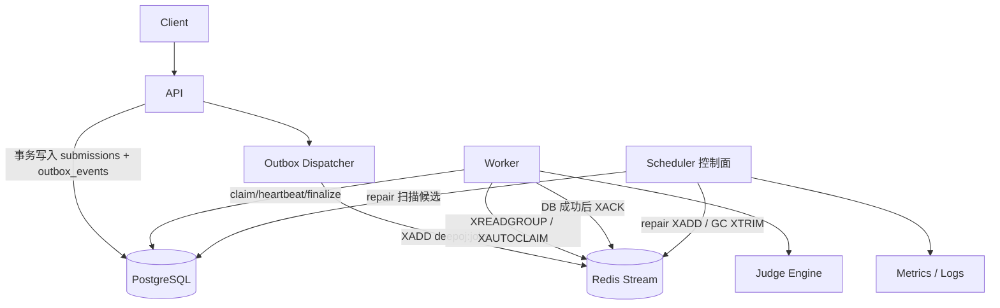

# Deep-OJ

Deep-OJ 是一个面向在线判题场景的分布式系统，采用 Go + C++ 实现。

当前仓库架构已收敛为 **Streams-only**：

- 唯一数据面链路：`API(outbox) -> Redis Stream -> Worker(XREADGROUP) -> DB finalize -> XACK -> reclaim(XAUTOCLAIM)`
- `scheduler` 保留为独立进程/容器，但只承担控制面职责
- 已移除 `etcd` 运行时依赖
- 已移除 legacy 数据面（Redis List + scheduler gRPC push 派单）

## 当前架构图



## 与旧架构对比（gRPC + etcd）

| 维度 | 旧架构（历史） | 当前架构（主线） |
| --- | --- | --- |
| 服务发现 | `etcd` 注册与续租 | `WORKER_ADDR/WORKER_ADDRS` 静态配置，无 etcd |
| 派单方式 | scheduler 通过 gRPC push 给 worker | worker 自主 `XREADGROUP` 拉取 |
| 队列介质 | Redis List | Redis Stream（`deepoj:jobs`） |
| 回收机制 | scheduler watchdog/retry/slow_path | worker `XAUTOCLAIM` + DB reclaim CAS |
| 数据面归属 | scheduler + worker 混合 | worker 独占数据面，scheduler 仅控制面 |
| 启动依赖 | etcd 不可用会影响启动 | 无 etcd 依赖，compose 不含 etcd |

## Scheduler（B3）控制面职责

`scheduler` 只启动控制面 loop，不触碰数据面派单与 ACK：

1. `RepairLoop`：从 DB 扫描需要重投递的任务，执行 `XADD` 回 `deepoj:jobs`
2. `GcLoop`：执行 Stream `XTRIM`；DB 清理默认 dry-run（默认不删除）
3. 观测：输出控制面指标与结构化日志

启动日志固定字段：

- `dispatch_mode=streams_only`
- `control_plane_only=true`
- `legacy_loops_started=0`
- `control_plane_loops_started=repair,gc`

## 核心约束

1. DB 是唯一状态机真相源，Redis Stream 仅负责驱动执行。
2. 仅当 `claim -> DB CAS(RUNNING)` 成功后才允许执行判题。
3. 仅当 DB finalize 成功后才允许 `XACK`。
4. reclaim 通过 `XAUTOCLAIM`，并按业务失败/系统失败分流。
5. scheduler 不启动 legacy loop（dispatch/ack_listener/watchdog/retry/slow_path）。

## 快速开始

### 依赖

- Docker + Docker Compose
- Linux（建议 cgroup v2）
- Python 3（集成脚本使用）

### 启动

```bash
cd /home/diguo/Deep_OJ

export JWT_SECRET='deepoj_dev_jwt_secret_change_me'
export ADMIN_USERS='admin'
export REDIS_PASSWORD='deepoj_redis_change_me'
export POSTGRES_PASSWORD='deepoj_pg_password_change_me'
export MINIO_ROOT_USER='deepoj_minio_user'
export MINIO_ROOT_PASSWORD='deepoj_minio_password_change_me'

docker compose up -d --build
docker compose ps
```

## 验收脚本

### 架构收敛验证

```bash
bash scripts/verify_b1_no_etcd.sh
bash scripts/verify_b2_no_legacy_dataplane.sh
bash scripts/verify_b3_control_plane.sh
```

### 功能与稳定性验证

```bash
bash scripts/verify_mvp2_e2e.sh
bash scripts/verify_mvp3_crash_recover.sh
bash scripts/verify_mvp4_observability.sh
bash scripts/verify_ci.sh
bash scripts/verify_g1_kill_all.sh
```

## Scheduler 控制面配置

可在 `config.yaml` 的 `scheduler.control_plane` 中配置，默认值如下：

| 配置项 | 默认值 | 说明 |
| --- | --- | --- |
| `repair_enabled` | `false` | 是否开启 repair |
| `repair_interval_ms` | `30000` | repair 周期 |
| `repair_batch_size` | `200` | repair 批大小 |
| `repair_min_age_sec` | `60` | 候选任务最小年龄 |
| `gc_enabled` | `false` | 是否开启 GC |
| `gc_interval_ms` | `600000` | GC 周期 |
| `stream_trim_maxlen` | `200000` | Stream 裁剪上限 |
| `db_retention_days` | `14` | DB 保留天数 |
| `db_delete_enabled` | `false` | 是否执行真实删除 |
| `db_delete_batch_size` | `500` | DB 删除批大小 |

说明：默认配置下 repair/gc 处于关闭状态，避免误操作。

## 目录说明（核心）

- `src/go/cmd/api`：API 入口
- `src/go/cmd/worker`：worker 入口
- `src/go/cmd/scheduler`：scheduler 控制面入口
- `src/go/internal/api`：提交、outbox、限流与观测
- `src/go/internal/worker`：Streams 消费、reclaim、fencing finalize
- `src/go/internal/scheduler`：repair/gc/控制面指标
- `src/core`：C++ 判题与沙箱执行核心
- `scripts`：验收与运维脚本

## 相关文档

- 设计与不变量：`DESIGN.md`
- 启动与排障：`RUNBOOK.md`
- 任务与验收证据：`TASK.md`

## License

MIT
